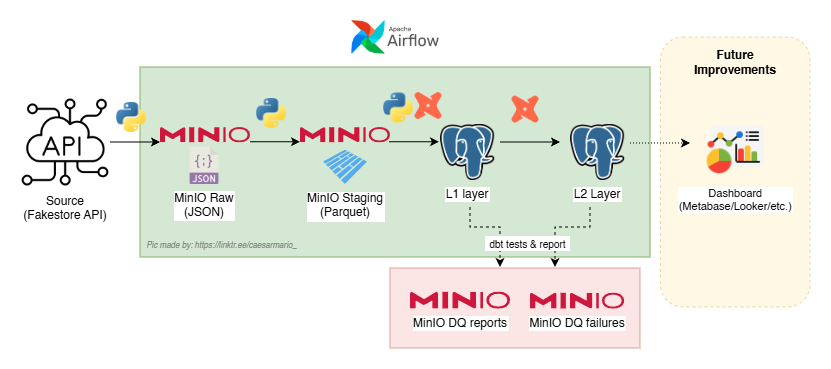
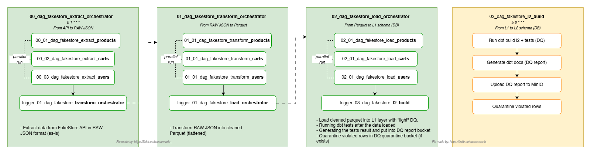

# Gramedia Digital — Fakestore Mini Data Pipeline

> **Repo:** https://github.com/caesarmario/gramedia-technical-test  

ETL pipeline yang mengambil data dari **FakeStore API --> MinIO (raw & staging) --> PostgreSQL (L1 & L2 via dbt)**.  

**Fitur utama**: orkestrasi Airflow, transform Parquet yang configurable, data quality (dbt tests + quarantine), dan _deliverables_ siap kirim (CSV + DQ reports + sampel raw/staging).

---

## Isi Singkat
- [Arsitektur & Flow](#arsitektur--flow)
- [Prasyarat](#prasyarat)
- [Setup & Boot](#setup--boot)
- [Airflow Variables (WAJIB)](#airflow-variables-wajib)
- [ETL Logic](#etl-logic)
- [Data Quality & Validation](#data-quality--validation)
- [dbt](#dbt)
- [Template Scripts & Reproducibility](#template-scripts--reproducibility)
- [Menjalankan Pipeline](#menjalankan-pipeline)
- [DAG 99 — Pack Deliverables](#dag-99--pack-deliverables)
- [Notebook Summary](#notebook-summary)
- [Backfill](#backfill)
- [Struktur Repo)](#struktur-repo)
- [Support me!](#support-me)

---

## Arsitektur & Flow

**Architecture (end-to-end):**  


**DAG flow (orkestrasi):**  


Catatan:
- Partisi ingest **terkunci oleh `ds`** (YYYY-MM-DD) sehingga _runs_ deterministik & mudah di-backfill.
- Semua script CLI menggunakan **`argparse`**, sehingga **bisa dites lokal** sebelum dipasang di Airflow.

---

## Prasyarat
- **Docker** & **Docker Compose**
- **Make** (opsional, tapi disarankan; repo menyertakan Makefile untuk mempermudah command)
- **Python 3.11+**
- Port:
  - Airflow UI (default di compose)
  - PostgreSQL (contoh: `5438`)
  - MinIO Console & API (sesuai compose)

---

## Setup & Boot

### 1) Clone repo
```bash
git clone https://github.com/caesarmario/gramedia-technical-test.git
cd gramedia-technical-test
```

### 2) Makefile
```bash
make up           # build + start seluruh stack
make down         # stop & remove
make nuke         # nuke
```
> Tidak pakai make? Gunakan `docker compose up -d` via UI/CLI .

### 3) PostgreSQL DB & Schema
- Secara otomatis PostgreSQL akan membuat 2 DB: `airflow` (untuk menyimpan metadata airflow) & `dwh` (untuk menyimpan data Fakestore)
- Loader akan membuat schema bila belum ada (L1: l1, L2 via dbt).
- Pastikan koneksi Postgres accessible dari container Airflow.

---

## Airflow Variables (WAJIB)

Set melalui **Airflow UI → Admin → Variables** atau CLI:

```bash
airflow variables set PROJECT_ROOT "/opt/airflow"
airflow variables set FAKESTORE_BASE_URL "https://fakestoreapi.com"
airflow variables set MINIO_CONFIG '{
  "MINIO_ENDPOINT": "minio:9000",
  "MINIO_ROOT_USER": "admin",
  "MINIO_ROOT_PASSWORD": "admin123",
  "MINIO_BUCKET_RAW": "raw-fakestore",
  "MINIO_BUCKET_STG": "stg-fakestore",
  "MINIO_BUCKET_DQ": "dq-failures",
  "MINIO_BUCKET_DQ_REPORTS": "dq-reports"
}'
airflow variables set DBT_PG_CONFIG '{
  "DBT_TARGET": "dev",
  "DBT_PG_HOST": "host.docker.internal",
  "DBT_PG_USER": "postgres",
  "DBT_PG_PASSWORD": "admin123",
  "DBT_PG_PORT": "5438",
  "DBT_PG_DBNAME": "dwh",
  "DBT_PROFILES_DIR": "/dbt",
  "PATH": "/home/airflow/.local/bin:/usr/local/bin:/usr/bin:/bin",
  "DBT_AUDIT_SCHEMA": "dq_audit"
}'
airflow variables set POSTGRESQL_CONFIG '{
  "POSTGRES_USER": "postgres",
  "POSTGRES_PASSWORD": "admin123",
  "POSTGRES_DB": "dwh",
  "POSTGRES_PORT": "5438",
  "POSTGRES_HOST": "host.docker.internal"
}'
airflow variables set SAMPLE_OUTPUT_DIR "/opt/project/assets/sample_output"
airflow variables set FAKESTORE_RESOURCES '["products","carts","users"]'
```

Buat bucket di MinIO:
```
raw-fakestore
stg-fakestore
dq-failures
dq-reports
```

---

## ETL Logic

1. Extract (`00_*`):
    - Ambil data dari FakeStore API → tulis ke MinIO **Raw** dalam format **JSON**.
    - Path contoh: `raw/<resource>/YYYY/MM/DD/<resource>_<ds>.json` atau `fakestore/<resource>/ds=<ds>/...`
2. Transform (`01_*`):
    - Baca **raw JSON** + **config JSON** per resource → normalisasi/flatten → tulis ke MinIO **Staging** sebagai **Parquet**.
3. Load L1 (`02_*`):
    - Baca Parquet dari MinIO Staging → **psycopg2** → Postgres **L1** (mode default `replace_partition`).
    - **dbt tests (L1 sources)** dijalankan setelah load.
    - **Quarantine** baris gagal test ke bucket` dq-failures`.
4. **Build L2** (`03_dag_fakestore_l2_build`):
    - `dbt build` untuk semua **models/l2**, menjalankan **tests** dan **docs generate**.
    - Artifacts (`run_results.json, manifest.json, catalog.json, index.html`) diunggah ke `dq-reports`.
    - Baris gagal test (store_failures) ikut di-**quarantine**.
5. Pack Deliverables (`99_dag_fakestore_pack_deliverables`):
    - Menyalin sampel output ke `assets/sample_output/*` di project (CSV L2, CSV L1 per table, DQ reports, serta satu file JSON & Parquet per resource untuk bukti).


---

## Data Quality & Validation
- **dbt tests** di L1 (sources) & L2 (models).
    - Hasil test + docs diunggah ke **MinIO** `dq-reports`.
    - Gagal test → **quarantine** ke **MinIO** `dq-failures` (berdasar `DBT_AUDIT_SCHEMA`).
- **Light checks** saat load L1:
    - `validation_utils.run_basic_checks(...)` memeriksa **not null, unique key, dan > 0** sesuai resource & config.
- **Typed transform**:
    - File config JSON per resource di `schema_config/fakestore_raw/<resource>_schema_config.json` menentukan **select/rename/casts/fill/derive/drop** sehingga tipe data Parquet **konsisten**.

---

## dbt
- `dbt build --select path:models/l2` + `--vars '{batch_ds: "..."}'` untuk batch tertentu.
- **Tests** dengan opsi **store_failures**, sehingga baris pelanggar bisa diekspor (quarantine).
- **Docs generate** → artifacts lengkap (run_results/manifest/catalog/index.html) **di-upload**.
- **Modeling L2** fokus pada:
    - `fact_sales` (menghitung total sales, ds, transaction date)
    - `dim_product` (atribut produk yang distandardisasi)
- **Gate**: pipeline mengasumsikan 03_* berhenti jika `dbt build` error.

---

## Template Scripts & Reproducibility
Script CLI (extract/transform/load) **templatized** (Jinja) dan bisa di-render cepat:
```bash
# CONTOH
python templates/render_scripts.py extract
python templates/render_scripts.py transform
python templates/render_scripts.py load
```
> Tujuan: bila ada **endpoint baru** cukup tambah config + render  agar integrasi cepat dan konsisten.

---

## Menjalankan Pipeline
### Opsi A — Satu klik via orchestrator
1. Trigger `00_dag_fakestore_orchestrator` dengan `conf={"ds":"YYYY-MM-DD"}`. Orkestrator akan memanggil **00 → 01 → 02 → 03** berurutan.
2. Setelah `03_*` selesai, jalankan `99_dag_fakestore_pack_deliverables` (opsional, untuk menyiapkan bundel contoh).

### Opsi B — Per stage
- Jalankan DAG `00_*` (extract) → `01_*` (transform) → `02_*` (load L1) → `03_*` (build L2).

Nama DAG penting:
- 00_dag_fakestore_orchestrator
- 01_dag_fakestore_transform_orchestrator
- 02_dag_fakestore_load_orchestrator
- 03_dag_fakestore_l2_build
- 99_dag_fakestore_pack_deliverables (opsional)

---

## DAG 99 — Pack Deliverables
Menyalin hasil ke lokal project (untuk dilampirkan ke submission atau dibagi ke stakeholder):
```
assets/sample_output/
├─ l2/
│  ├─ cleaned_data.csv
│  └─ dim_product.csv
├─ l1/
│  ├─ l1_products.csv
│  ├─ l1_carts.csv
│  └─ l1_users.csv
├─ dq-reports/
│  ├─ run_results.json
│  ├─ manifest.json
│  ├─ catalog.json
│  └─ index.html
└─ raw/
   ├─ json/<resource>.json
   └─ parquet/<resource>.parquet
```
> Jalankan setelah `03_*` berhasil agar CSV L2 dan DQ reports sudah tersedia.

---

## Notebook Summary
- Notebook berada di `assets/notebook_summary.ipynb`.
- Membaca `assets/sample_output/l2/cleaned_data.csv` & `dim_product.csv` lalu menampilkan:
    - KPI (Revenue, Orders, Items, Unique Products, AOV)
    - Grafik tren harian, Top Category, Top Product, Distribusi harga
    - *Snapshot DQ* dari `dq-reports/run_results.json`

---

## Backfill
Lakukan per **batch** `ds` melalui **Airflow UI** (Trigger DAG dengan `conf={"ds":"YYYY-MM-DD"}`) atau skenario loop CLI:
```bash
for d in 2025-11-05 2025-11-06 2025-11-07; do
  airflow dags trigger 00_dag_fakestore_orchestrator --conf "{\"ds\":\"$d\"}"
done
```
> Desain path `ds` membuat backfill **deterministik** dan **idempotent** (mode load `replace_partition` akan mengganti partisi yang sama).

---

## Struktur Repo
```bash
gramedia-techincal-test/
├─ .github/
├─ airflow/
│  ├─ dags/
│  │  ├─ 00_01_dag_fakestore_extract_products.py
│  │  ├─ 00_02_dag_fakestore_extract_carts.py
│  │  ├─ 00_03_dag_fakestore_extract_users.py
│  │  ├─ 00_dag_fakestore_extract_orchestrator.py
│  │  ├─ 01_01_dag_fakestore_transform_products.py
│  │  ├─ 01_02_dag_fakestore_transform_carts.py
│  │  ├─ 01_03_dag_fakestore_transform_users.py
│  │  ├─ 01_dag_fakestore_transform_orchestrator.py
│  │  ├─ 02_01_dag_fakestore_load_products.py
│  │  ├─ 02_02_dag_fakestore_load_carts.py
│  │  ├─ 02_03_dag_fakestore_load_users.py
│  │  ├─ 02_dag_fakestore_load_orchestrator.py
│  │  ├─ 03_dag_fakestore_l2_build.py
│  │  └─ 99_dag_fakestore_pack_deliverables.py
├─ assets/
│  ├─ sample_output/
│  │  ├─ dq-reports/
│  │  │  ├─ catalog.json
│  │  │  ├─ index.html
│  │  │  ├─ manifest.json
│  │  │  └─ run_results.json
│  │  ├─ l1/
│  │  │  ├─ l1_carts.csv
│  │  │  ├─ l1_products.csv
│  │  │  └─ l1_users.csv
│  │  ├─ l2/
│  │  │  ├─ cleaned_data.csv
│  │  │  └─ dim_product.csv
│  │  └─ raw/
│  │     ├─ json/
│  │     │  ├─ carts.json
│  │     │  ├─ products.json
│  │     │  └─ users.json
│  │     └─ parquet/
│  │        ├─ carts.parquet
│  │        ├─ products.parquet
│  │        └─ users.parquet
│  ├─ architecture_diagram.png
│  ├─ dag_flow.png
│  ├─ diagram.drawio
│  └─ notebook_summary.ipynb
├─ docker/
│  ├─ initdb/
│  │  └─ init-multiple-db.sql
│  ├─ .env
│  ├─ Dockerfile
│  └─ requirements.txt
├─ schema_config/
│  └─ fakestore_raw/
│     ├─ carts_schema_config.json
│     ├─ products_schema_config.json
│     └─ users_schema_config.json
├─ scripts/
│  ├─ dbt/
│  │  ├─ logs/...
│  │  ├─ macros/
│  │  │  ├─ clean_category.sql
│  │  │  └─ custom_schema.sql
│  │  ├─ models/
│  │  │  ├─ l2/
│  │  │  │  ├─ staging/
│  │  │  │  │  ├─ stg_carts_l2.sql
│  │  │  │  │  └─ stg_products_l2.sql
│  │  │  │  ├─ dim_product.sql
│  │  │  │  ├─ fact_sales.sql
│  │  │  │  └─ schema.yml
│  │  │  └─ l1_sources.yml
│  │  ├─ target/...
│  │  ├─ tests/
│  │  │  ├─ l1_carts_compound_pk.sql
│  │  │  ├─ l1_carts_quantity_positive.sql
│  │  │  ├─ l1_products_price_nonneg.sql
│  │  │  ├─ l1_products_rating_count_nonneg.sql
│  │  │  ├─ l1_products_rating_range.sql
│  │  │  ├─ l2_fact_sales_price_nonneg.sql
│  │  │  ├─ l2_fact_sales_quantity_positive.sql
│  │  │  └─ l2_fact_sales_total_matches.sql
│  │  ├─ .user.yml
│  │  ├─ dbt_project.yml
│  │  └─ profiles.yml
│  ├─ extract/
│  │  ├─ extract_carts.py
│  │  ├─ extract_products.py
│  │  └─ extract_users.py
│  ├─ load/
│  │  ├─ load_carts_parquet_to_l1.py
│  │  ├─ load_products_parquet_to_l1.py
│  │  └─ load_users_parquet_to_l1.py
│  └─ transform/
│     ├─ transform_carts_to_parquet.py
│     ├─ transform_products_to_parquet.py
│     └─ transform_users_to_parquet.py
├─ template/
│  ├─ dag/
│  │  ├─ config/
│  │  │  └─ extract_fakestore_resources.yaml
│  │  ├─ extract_fakestore_dag.py.j2
│  │  ├─ extract_orchestrator_fakestore_dag.py.j2
│  │  ├─ load_fakestore_dag.py.j2
│  │  ├─ load_orchestrator_fakestore_dag.py.j2
│  │  ├─ transform_fakestore_dag.py.j2
│  │  └─ transform_orchestrator_fakestore_dag.py.j2
│  ├─ script/
│  │  ├─ config/
│  │  │  └─ extract_fakestore_config.yaml
│  │  ├─ extract_fakestore_template.py.j2
│  │  ├─ load_fakestore_to_l1.py.j2
│  │  └─ transform_fakestore_to_parquet.py.j2
│  └─ render_scripts.py
├─ utils/
│  ├─ api_utils.py
│  ├─ etl_utils.py
│  ├─ logging_utils.py
│  └─ validation_utils.py
├─ .gitignore
├─ docker-compose.yml
├─ LICENSE
├─ Makefile
└─ README.md
```

---

---
## Support me!

👉 If you find this project useful, **please ⭐ this repository 😆**!
---

👉 _More about myself: <a href="https://linktr.ee/caesarmario_"> here </a>_